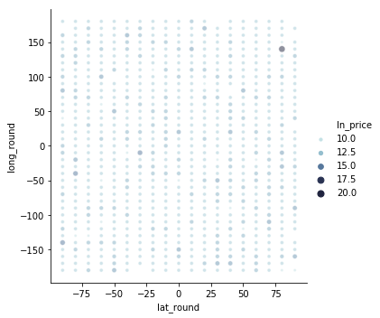
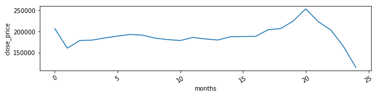
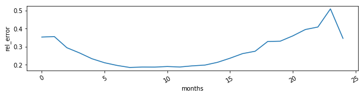

###  Summary of KNN Challenge

The data includes a set of latitude / longitude for houses sold at different dates.
The goal is to create an KNN model that predicts the precise of a house based on
it's K nearest neighbor.

##### Below are the data considerations:
* Pricing label: About 2-3% of the closing prices were zero value or negative values.
This is likely to be an error, so for the purpose of this tasks, without further insight
into why these values exist, we will exclude these values. Creating prediction where
the price is zero or negative is not very helpful.

* KNN training features: Analysis of the data confirms that there are variations
between prices based on location. There are also variations over time, but the
shift in median median close price seem to occur 2015-2016, where a precipitous
an increase in housing price was followed by a drop. Prior to this, prices were
relatively steady. For the purpose of this model, I will use euclidean distance
of lat and long from target to determine the overall distance, and use
closing date to filter out data points occurring after the target to prevent
leakage. Since lat and long are on the same scale, feature scaling will not be
necessary before training. Closing date will be used to filter out data that
does not belong in the training dataset.

##### As well as some modeling considerations:
* Training: Unlike other types of models, the training and prediction steps are
combined  so the dataset is not split before running into training / evaluation
data. Rather, at each step I include all observations that occur before
the target prediction data in the training set.

* K-number: The current model runs with K = 4. To optimize prediction accuracy, 
we can tweak this number in the future, and optimize based on MRAE.

* Weights: There are different options for how we weight each of the neighbor.
We can either weigh them equally or we can weigh them based on inverse distance.
Having tried it out both ways, the best prediction seems to b

##### Discussion

**What is the performance of the model measured in Median Relative Absolute Error?**

The median relative absolute error is 20%, so that means for 50% of the prediction
we expect the predicted price to be 20% above actual closing price.

* What would be an appropriate methodology to determine the optimal k?

Optimal k can be determined by measuring MRAE on different k values, inferred
on the entire dataset. Note that because the training and inference step
is combined and and calculating our target criterion. The function
`iterMultipleK` in `model.py` provides the steps iterate and calculate MRAE
at varying k values. One consideration when testing for optimal k is how slow
and time-consuming currently training takes. Two suggestions around this:
 * If we calculate using log-prices rather than prices,
     the runtime can be slightly faster.
 * For the purpose of hyperparameter tuning, we might also want to run the
     model with approximate neighbors.

**Do you notice any spatial or temporal trends in error?**

The error has a temporal trend that corresponds with the change in closing price
over time. There are higher errors at the start, obviously because there are
fewer good comps to draw from in the sample. The error rates reach an optimal
with 6 months of data to draw from but then started to increase again in 2015.
This increase relates to the steady increase in price which resulted in the
past training points being last comparable to new price. When the price
dipped past a certain level, the error rate also dropped.

**How would you improve this model?**

Here are some potential improvements to test out:
1. Adding features: Include dates as an additional training feature, so we can
chose a more recent data point given similar lat/long distance from target.
Other features such as market and neighborhood indicators may also be helpful
to include.

2. Training data: Exclude datapoints further than certain distances. Using
datapoints too far from the target may not be helpful, so set limits
on distances to far from target point.

**How would you productionize this model?**

This model, I imagine, can be run overnight and may not need to be regenerated
every hour. Here are steps I would take to productionize model:
1. Create data pipelines and ETL to store the training and inference features
needed to generate new predictions every night.
2. Create unit tests for functions for functions
3. Set up API endpoints to generate prediction
4. Store the error rate generated every night, automate an alert or revert to
previous data if error outside of acceptable range. Create visualization to
track error rates.

With the KNN model, I expect some challenges with setting up the training
model because the entire training data need to be stored in memory
and as the dataset grows larger, it may become more time consuming to generate
run the model. Other than using approximate distnace, one solution to this may
be to store previous euclidean distance measures for K neighbors for each
prediction data point and then only running a nightly job on new available
training / prediction data.

